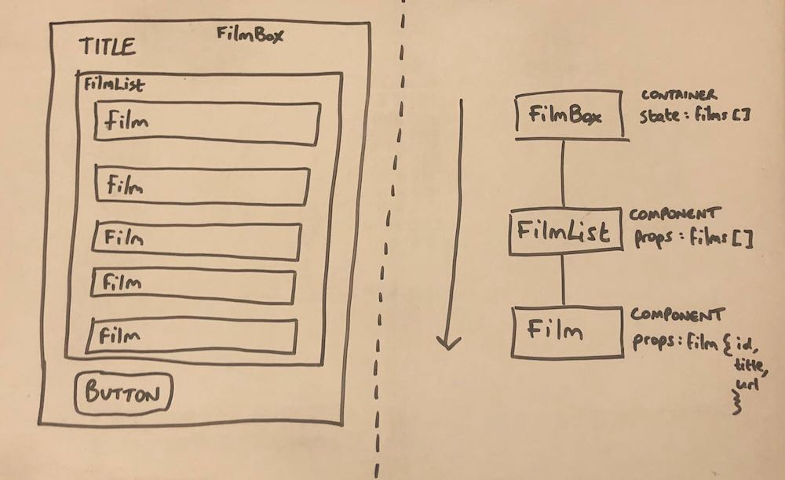
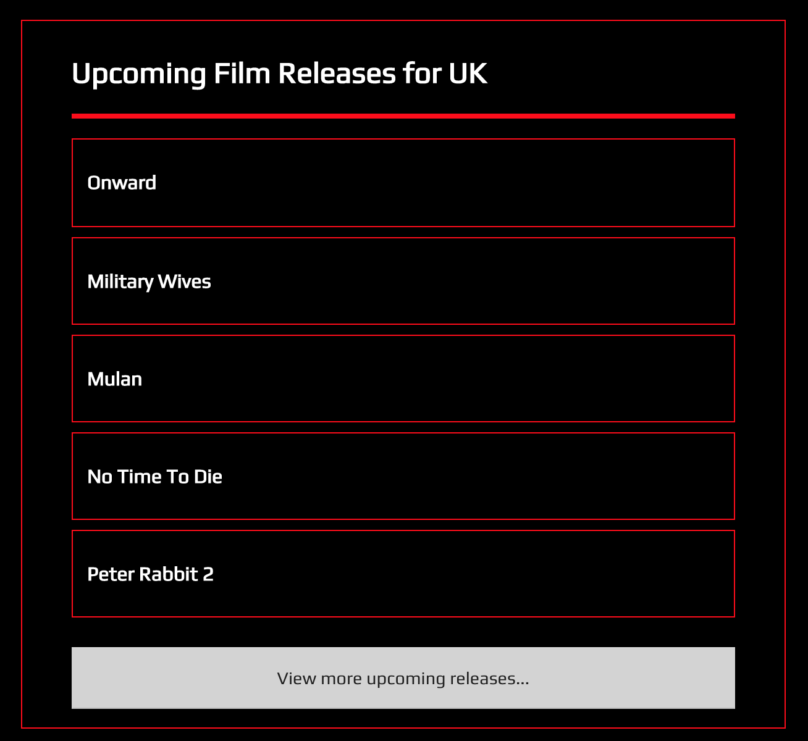

# Learning React

This evening homework was completed in 2 hours to consolidate day 1 of learning React.

Tasks completed:
1. UI drawing to understand required components
2. Outline component hierarchy and data flow
3. Build React App and style

Sketches - (L) UI, (R) component hierarchy and dataflow:

App:

# Brief:

You task is to plan and build an application that displays a list of upcoming film titles, each one linking to their imdb page.

- Draw out the UI on paper, breaking it down into components.
- Draw a component hierarchy diagram, noting down any state and props for each component.
- Implement the application in React.
- Note: The 'View more upcoming releases' button can link to the imdb calendar page - https://www.imdb.com/calendar/?region=gb
